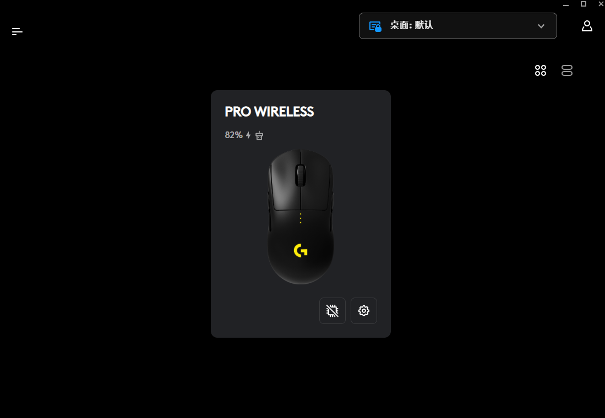
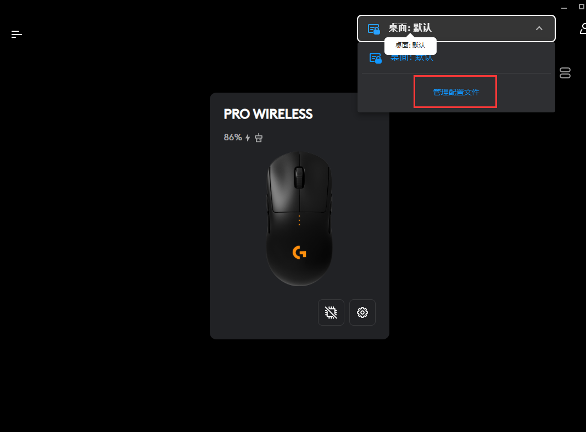
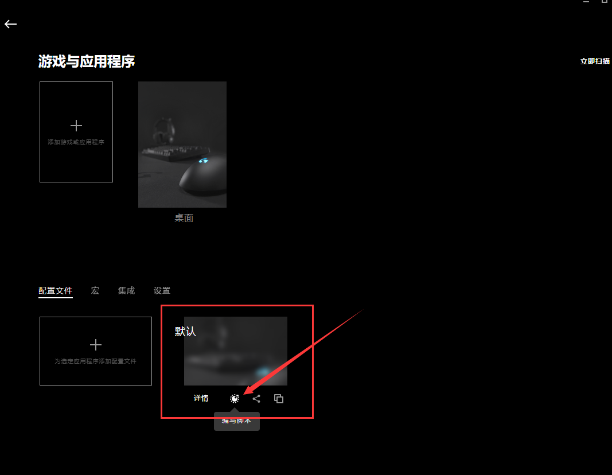
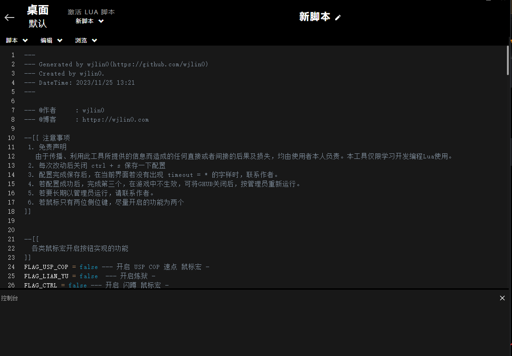
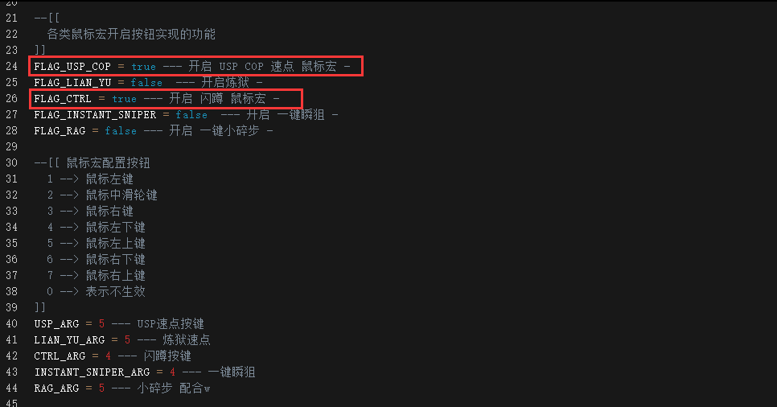
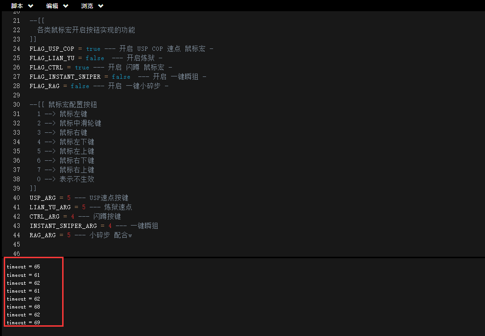

# CF-LUA 鼠标宏

## 介绍
> `cf-lua` 是基于 logitech(罗技鼠标) api开发而来,所以是支持罗技旗下的各类鼠标,通过简单的配置,达到鼠标宏的效果。

> ~~这个项目，是我看到游戏主播他们扣usp，扣的那么快 确实达不到，那就不如 自己开发一个 安全、且不易察觉随机区间的鼠标宏.~~

> ~~所以，好汉留下个点赞不过分吧 呜呜呜~~

## 安装

本工具是基于 logitech 开发的所以你需要去罗技官网下载 [Logitech G HUB](https://download.logitech.com.cn/web/ftp/pub/techsupport/gaming/lghub_installer.exe) 并安装。安装完成后,若你的鼠标为罗技旗下的,那么你将看到以下画面

## 配置

安装好`Logitech G HUB` 后,将 本项目中的`index.hub` 内容复制到 `Logitech G HUB` 配置文件中,如以下步骤

- 打开配置文件

- 选择默认-> 编写脚本

- 复制 index.lua(或者打开[在线地址](https://raw.githubusercontent.com/wjlin0/cf-lua/refs/heads/main/index.lua)) 中的内容

- 复制完成后 修改 需要开启的功能 以及功能的安装,在本项目中,所有功能(除一键瞬狙外)均是长按触发,如下图所示

- 注意此时, 同时开启的功能按键避免冲突,否则会导致功能失效,如上图所示,同时开启`闪蹲`和`USP COP速点`,且两功能不互相冲突即可。

- 在进入游戏前,应当测试其功能是否正常,当你长按你开启功能的侧键时,终端应该显示 `timeout= *`的字样,如下图所示

- 若你还是未能完成功能,请检查你的配置文件是否正确,或者在该项目中`issues`提出你的问题,我会第一时间来解答
